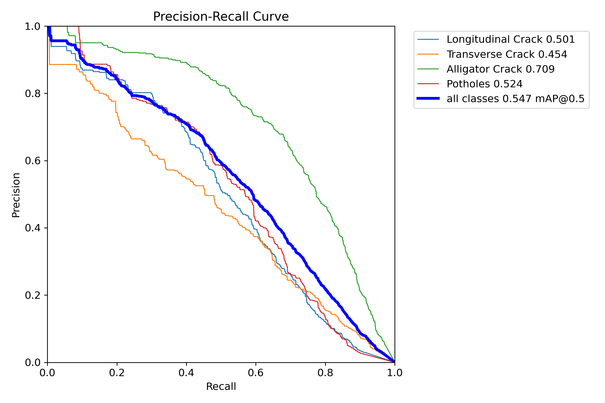
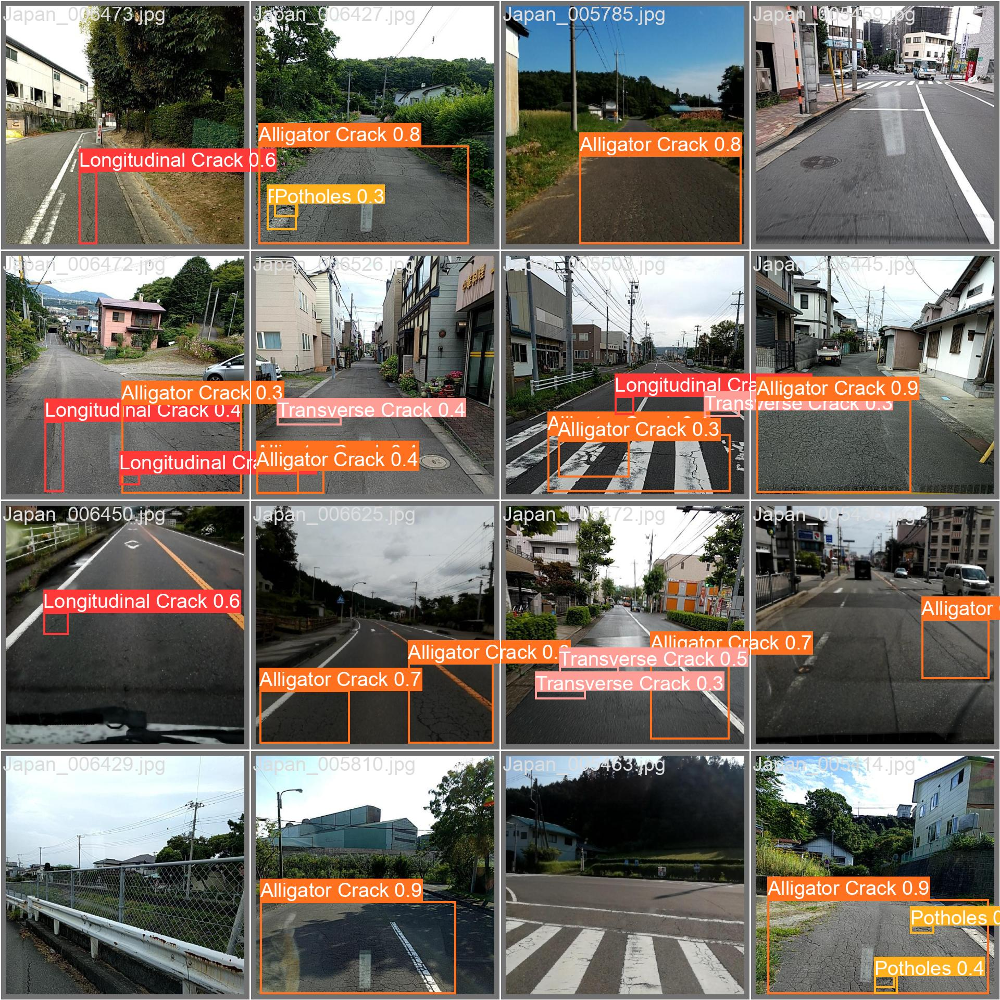

# Road Damage Detection Applications

This project is road damage detection applications that designed to enhance road safety and infrastructure maintenance by swiftly identifying and categorizing various forms of road damage, such as potholes and cracks.

## Performing Detection Using Image

## Performing Detection Using Video

The project is powered by YOLOv8 deep learning model that trained on Crowdsensing-based Road Damage Detection Challenge 2022 dataset.

There is four types of damage that this model can detects such as:
- Longitudinal Crack
- Transverse Crack
- Alligator Crack
- Potholes

## Running on Local Server

## Evaluation Result

This is the training result of the YOLOv8s model that trained on the filtered Japan and India dataset with RTX2060 GPU. You can perform the evaluation on your dataset with **2_EvaluationTesting.ipynb** notebook, just convert your dataset into ultralytics format.

    
    
    

